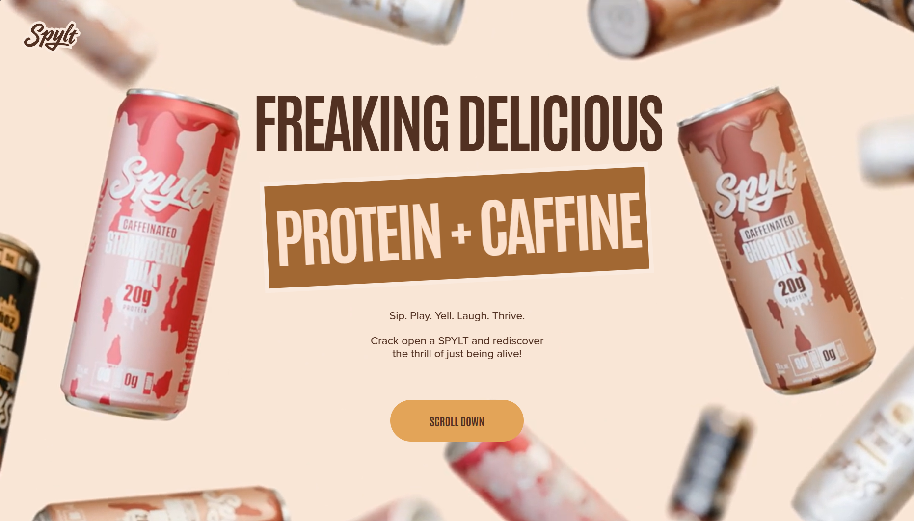
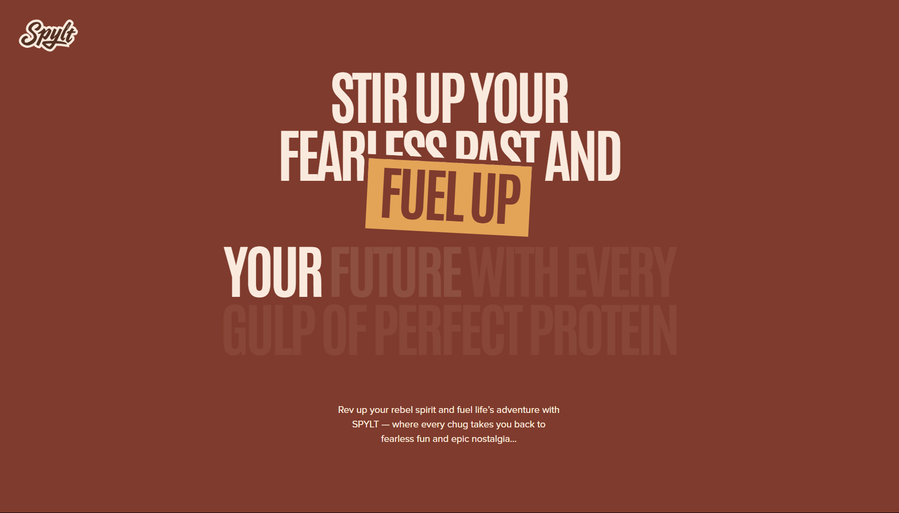
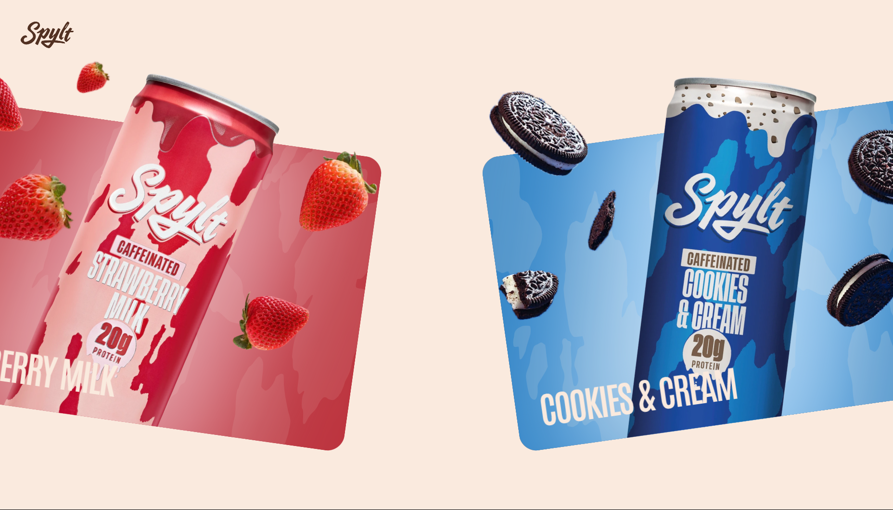
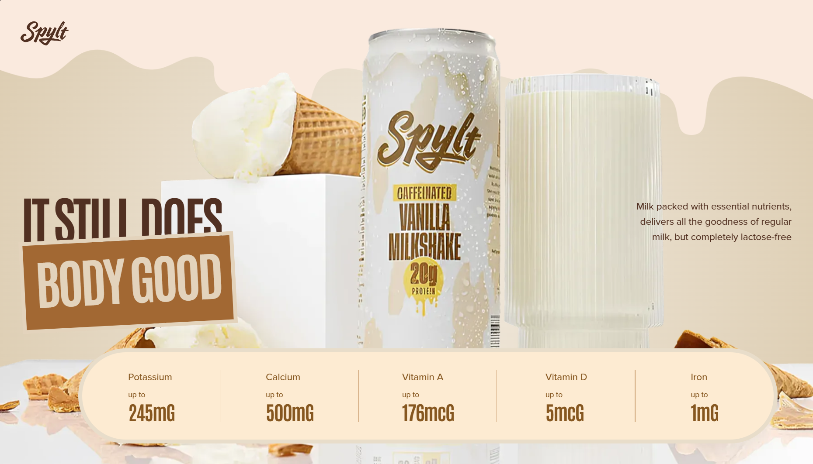
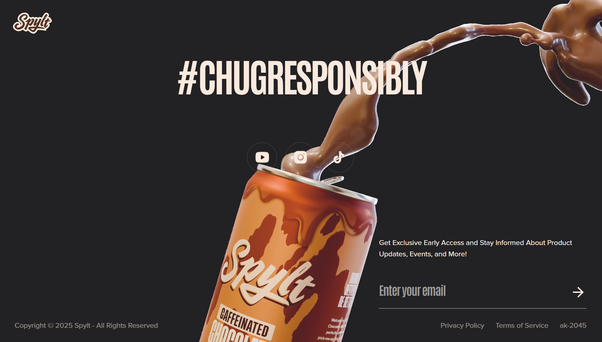

# **SPYLT Website _(using react, tailwing & GSAP)_**

**SPYLT** is a dynamic, design-forward web experience inspired by the energy of its product — a fusion of *protein* and *caffeine* crafted for those who live boldly. This project recreates the essence of an original commercial website using **React**, **Tailwind CSS**, and **GSAP**, combining **parallax motion** and **scroll-triggered animations** for an immersive, modern aesthetic.

---

## **Tech Stack**

- **React.js** – Component-based architecture for dynamic and responsive user interfaces.  
- **Tailwind CSS** – Utility-first framework for elegant, efficient styling.  
- **GSAP (GreenSock Animation Platform)** – Smooth, high-performance animations for scrolling and transitions.

---

## **Features**

- **Immersive Parallax Effects** – Layered depth and smooth motion for visual engagement.  
- **Scroll-Based Animations** – Fluid, interactive storytelling through GSAP ScrollTrigger.  
- **Custom Typography and Theme** – Bold, minimal, and product-driven color and font combinations.  
- **Fully Responsive** – Seamlessly adapts to all device sizes.  
- **Performance-Oriented Design** – Optimized animations and layout transitions.

---

## **Design Language**

The design aesthetic mirrors the tone of the brand — bold, earthy, and energetic.  
A refined color palette and strong typography establish the project’s visual identity.

| Color Role | Hex Code |
|-------------|-----------|
| Dark Brown | `#523122` |
| Mid Brown | `#A26833` |
| Light Brown | `#E3A458` |
| Milk Yellow | `#E3D3BC` |
| Red Brown | `#7F3B2D` |
| Milk | `#FAEADE` |

**Typography:**
- **Headings:** *Antonio*, sans-serif  
- **Paragraphs:** *Proxima Nova*, sans-serif  

---

## **Project Showcase**

Screenshots demonstrating various sections and animation effects:

| Screenshot | Description |
|-------------|-------------|
|  | Hero section featuring parallax entry and layered typography. |
|  | Smooth scroll-triggered GSAP animations that reveal key product messages in a dynamic, engaging way.|
|  | A simple slider to showcase products. |
|  | Smooth reveal of nutritional details. |
|  | Minimalistic footer with social links and elegant spacing. |

---

## **Core Styling Overview**

SPYLT’s design leverages Tailwind’s extendable theme system and GSAP’s animation capabilities for cohesive motion and consistency.

```css
@import url("https://fonts.googleapis.com/css2?family=Antonio:wght@100..700&display=swap");
@import "tailwindcss";

@font-face {
  font-family: "ProximaNova, sans-serif";
  src: url("/fonts/ProximaNova-Regular.otf");
}

@theme {
  --color-main-bg: #232224;
  --color-milk: #faeade;
  --font-sans: "Antonio", sans-serif;
  --font-paragraph: "ProximaNova, sans-serif";
}
````

Reusable utility classes:

```css
@layer utilities {
  .flex-center {
    @apply flex justify-center items-center;
  }
  .abs-center {
    @apply absolute top-1/2 left-1/2 -translate-x-1/2 -translate-y-1/2;
  }
}
```

---

## **Setup Instructions**

1. Clone the repository

   ```bash
   git clone https://github.com/your-username/spylt.git
   cd spylt
   ```
2. Install dependencies

   ```bash
   npm install
   ```
3. Start the development server

   ```bash
   npm run dev
   ```
4. Open the website at:
   **[Visit SPYLT Website](https://your-website-link.com)**

---

## **Credits**

**Developed by:** *Akmal Hossain*
**Inspired by:** [Fullstack Empire – SPYLT Website Animation Tutorial](https://youtu.be/pqYxZ8jd768)

Built with a deep appreciation for design, performance, and motion storytelling.
